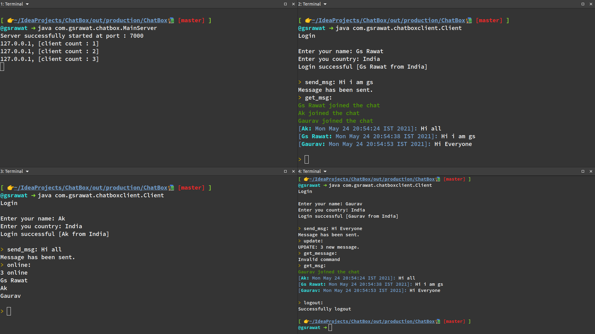

<!-- ABOUT THE PROJECT -->

## About The Project

This project is a simple chatroom where multiple clients can join simultaneously and can text to each other.

### Screenshot



### Built With

Built with java using socket programming.

### How To Run Project

1. Clone the `Repo`
   ```sh
   git clone https://github.com/Gs-Rawat/ChatBox.git
   ```
2. Start the `Server`
   ```sh
   cd ChatBox/src/com/gsrawat/chatbox
   javac MainServer.java
   java MainServer
   ```
3. Run the `Client`
   ```sh
   cd ChatBox/src/com/gsrawat/chatboxclient
   javac Client.java
   java Client
   ```

You can run as many clients as you want in different terminals.

### Commands

```text
get_msg:    get all the messages
help:       display all the commands
logout:     leave the chatroom
online:     check how many people are online
send_msg:   send text
update:     check if there is any new message
```